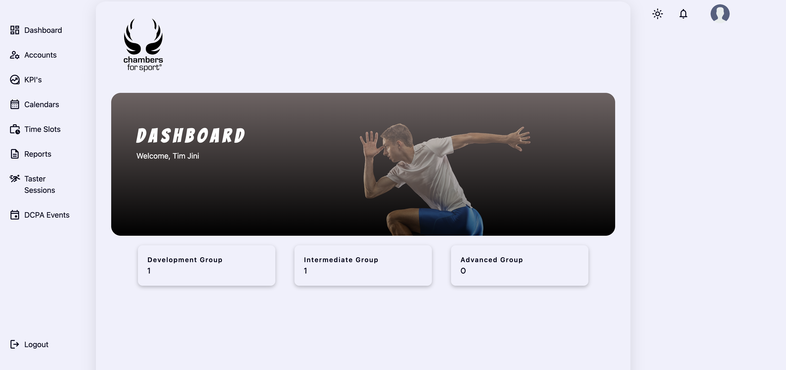
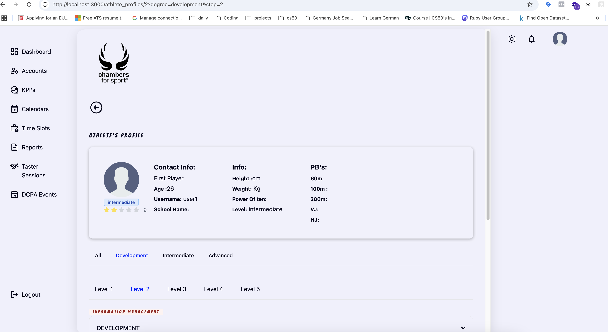
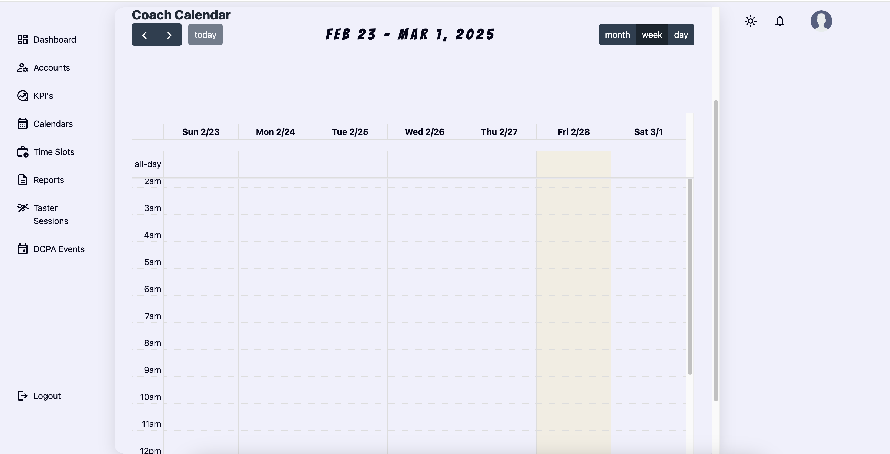

# MyRailsApp

## Overview
MyRailsApp is a Dockerized Ruby on Rails application designed for athlete onboarding, KPI tracking, coaching schedules, and event management. It includes a scoring service, form handling, and supports multiple websites. The app leverages Stripe for payments and SendGrid for email notifications.

## Features
- **Athlete Management**: Onboarding and KPI tracking for athletes.
- **Coaching & Scheduling**: Recurring calendar management for coaches.
- **Event Management**: Yearly events, sessions, and packages.
- **Forms Handling**: Supports multiple websites.
- **QR Code Generator**: Generates QR codes for easy access.
- **CSV Uploader**: Bulk data upload for quick processing.
- **Scoring Service**: Athlete performance assessment with detailed scoring.
- **API Serialization**: Uses serializers for structured API responses.
- **Testing & Code Quality**:
  - RSpec for testing.
  - Rubocop and Husky for code linting and pre-commit hooks.
- **Storage & Background Jobs**:
  - Active Storage for handling media.
  - R2 Cloudflare Bucket for media storage.
  - JWT gem for authentication.
  - Sidekiq for job processing.
- **UI & Styling**: Built with Tailwind CSS for modern design.

## Setup Instructions
### Prerequisites
- Docker & Docker Compose
- Ruby on Rails
- PostgreSQL
- Redis for Sidekiq

### Installation
1. Clone the repository:
   ```sh
   git clone https://github.com/your-repo/myrailsapp.git
   cd myrailsapp
   ```
2. Copy the environment file:
   ```sh
   cp .env.example .env
   ```
3. Build and start the Docker containers:
   ```sh
   docker-compose up --build
   ```
4. Run database migrations:
   ```sh
   docker-compose run web rails db:create db:migrate db:seed
   ```
5. Start Sidekiq for background jobs:
   ```sh
   docker-compose run web bundle exec sidekiq
   ```

## Environment Variables
Ensure you configure the following environment variables:
```env
DATABASE_URL=postgres://user:password@db/myrailsapp
REDIS_URL=redis://redis:6379/1
STRIPE_SECRET_KEY=your_stripe_secret
SENDGRID_API_KEY=your_sendgrid_key
JWT_SECRET=your_jwt_secret
CLOUDFLARE_R2_ACCESS_KEY=your_r2_access_key
CLOUDFLARE_R2_SECRET_KEY=your_r2_secret_key
```

## API Documentation
API responses are structured using serializers. Example endpoints:
- `POST /api/v1/athletes` - Create an athlete
- `GET /api/v1/coaches/schedules` - Fetch coaching schedules
- `POST /api/v1/scoring` - Submit a scoring entry

## Testing
Run tests using RSpec:
```sh
docker-compose run web bundle exec rspec
```

## Code Quality
Ensure your code follows best practices with:
```sh
bundle exec rubocop
```

## Screenshots
### Dashboard


### Scoring Screen


### Schedules Screen


## License
This project is licensed under the MIT License.

---
Feel free to contribute and submit issues on GitHub!

